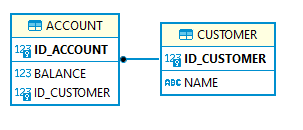
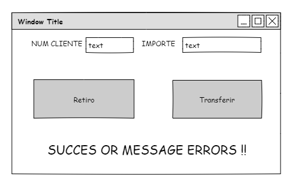

 [](https://sonarcloud.io/summary/new_code?id=jaehoo_oz-ex-atm-desc)
[](https://sonarcloud.io/summary/new_code?id=jaehoo_oz-ex-atm-desc) 

# ATM Java Project

This project is an example to show you some basic concepts of the Java development using the DAO pattern with Spring and Hiberante, including the test execution with JUnit. The main topics to cover are:

- IoC (Inversion Of Control)
- High Cohesion
- Low Coupling
- Polymorphism


Also, the project has been configured to execute some useful plugins for development, like:

- Project versioning (semantic versioning)
- Code coverage with Jacoco
- Maven Site documentation
- Javadoc generation
- Junit tests execution
- Creating a Database in memory with H2

**What we're going to build?**

A simple Java application to simulate an ATM functionality with two operations (withdraw and transfers).

If you need more details about this project you can take a look in [this entry in my blog](https://jaehoo.wordpress.com/2013/06/20/oz-ejemplo-cajero-atm/), there is a guide with the step by step explaining the creation of the classes.

For the transactional DB operations it is needed create two tables:



The frontend is simple a Swing gui application (developed in Netbeans):



## Requirements

- Java > 1.8
- Apache Maven > 3.6


## Installation

### Testing

```sh
# Unit tests
mvn test -P jacoco

# Unit tests and integration tests 
mvn test integration-test -P jacoco,it-test

# Only integration tests
mvn integration-test -P jacoco,it-test -DskipUnitTests=true
```

### Build

To build the artifacts execute the maven goals at the top project folder, add the argument `-DskipTests=true` to avoid unit tests:

```sh
# Unit tests with build
mvn verify -P jacoco

# Make artifacts skipping unit tests
mvn clean package -DskipTests=true

# Generate java doc main sources
mvn javadoc:javadoc -P documenter -Dsourcepath=src/main/java

# Generate javadoc from test sources 
mvn javadoc:test-javadoc -P documenter -Dsourcepath=src/test/java

# Make site documents
mvn site -P documenter,site-readme,spotbugs
```

### Code inspection

```sh
# Execute analyse
mvn spotbugs:spotbugs -P spotbugs

# Show report analyse in a gui
mvn spotbugs:gui -P spotbugs
```

## Release

### Release to SCM repository

Promote changes into source code repository to publish a tagged release of the project, use one of the next commands according that you need to execute. Please, note that it will do some changes in the repository. 

```sh
# clean release
mvn release:clean -P scm-release

#update project versions
mvn release:update-versions P scm-release

# Simulation mode 
mvn release:prepare -P scm-release -DskipTests  \
-Darguments="-DskipTests -DpushChanges=false -DdryRun=true -DdeveloperConnectionUrl=scm:git:${git.repo.url}"

# Interactive mode
mvn release:prepare -P scm-release -DskipTests  \
-Darguments="-DskipTests -DdryRun=false -DdeveloperConnectionUrl=scm:git:${git.repo.url}"

# Non interactive
mvn release:prepare -P scm-release \
-DdryRun=false \
-DdevelopmentVersion=1.0.5-SNAPSHOT \
-DreleaseVersion=1.0.5 \
-Dtag=v1.0.5 \
-DdeveloperConnectionUrl="scm:git:${git.repo.url}"

``` 

---
<p align="center">
  
</p>


License
-------

This project is copyright by **Orbital Zero**, it is free software and may be redistributed under the terms specified in the `LICENSE` file.

The names and logos for this sample code are trademarks of their respective owners, which are in no way associated or affiliated with Orbital Zero. Product names and logos are used solely for the purpose to show specific examples of software development, not for commercial use. Use of these names does not imply any co-operation or endorsement.


Credits
-------
This project is maintained by [Orbital Zero, inc](http://www.orbitalzero.com/community)
and people like you =). Thank you!