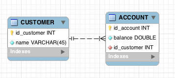

 
[Sonarqube Analyze Report](https://sonarcloud.io/dashboard?id=com.oz%3Aatm)

# ATM Java Project

### Description
This project is an example to show you some basic concepts of the java development, how to use DAO pattern using Spring and hiberante and testing with JUnit. The principal topics are:

 - IoC (Inversion Of Control)
 - High Cohesion
 - Low Coupling
 - Polymorphism

And this includes the JaCoCo test Report, aditionally the project is configured to use cloud services with Travis CI for integration and Coveralls for coverage reports.

## Project requirements:

- Java 1.8
- Apache Maven > 3.0

**What we're to build?**

A simple Java application with swing gui, if you want to read full description you can visit my [Personal Blog](https://jaehoo.wordpress.com/2013/06/20/oz-ejemplo-cajero-atm/)

But in summary we're build an aplication to simulate ATM funcionality with two operations (withdraw and transfers):

The database:

Credits
-------

This project is maintained by [Orbital Zero, inc](http://www.orbitalzero.com/community)
and people like you :) . Thank you!

License
-------

**This project** is copyright 2018 by Jaehoo (Alberto Sánchez) and Orbital Zero,inc. It is free software, and may be redistributed under the terms specified in the `LICENSE` file.

The names and logos for this sample code are trademarks of their respective owners, which are in no way associated or affiliated with Orbital Zero.
Product names and logos are used solely for the purpose to show specific examples of software development, not for comercial use. Use of these names does not imply any co-operation or endorsement.